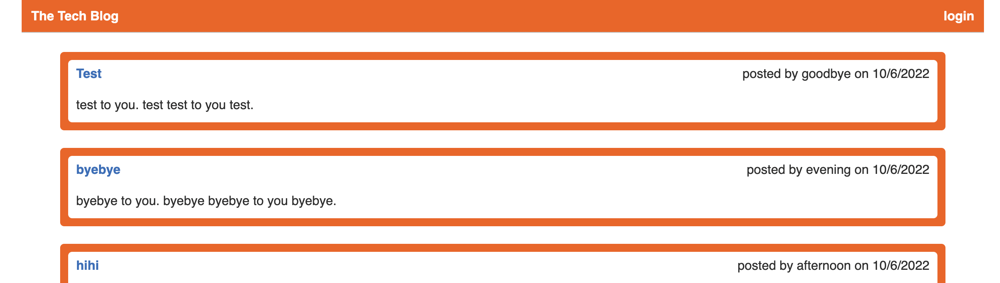
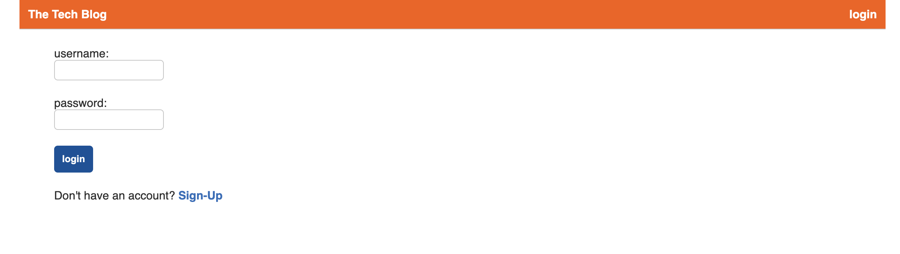
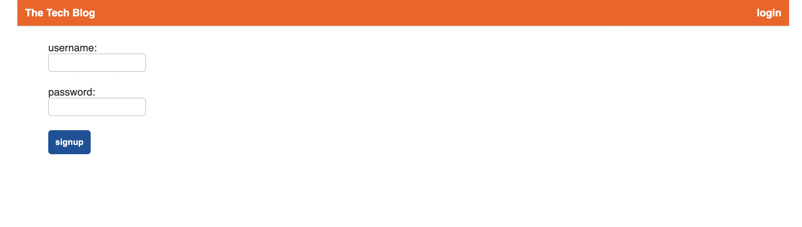
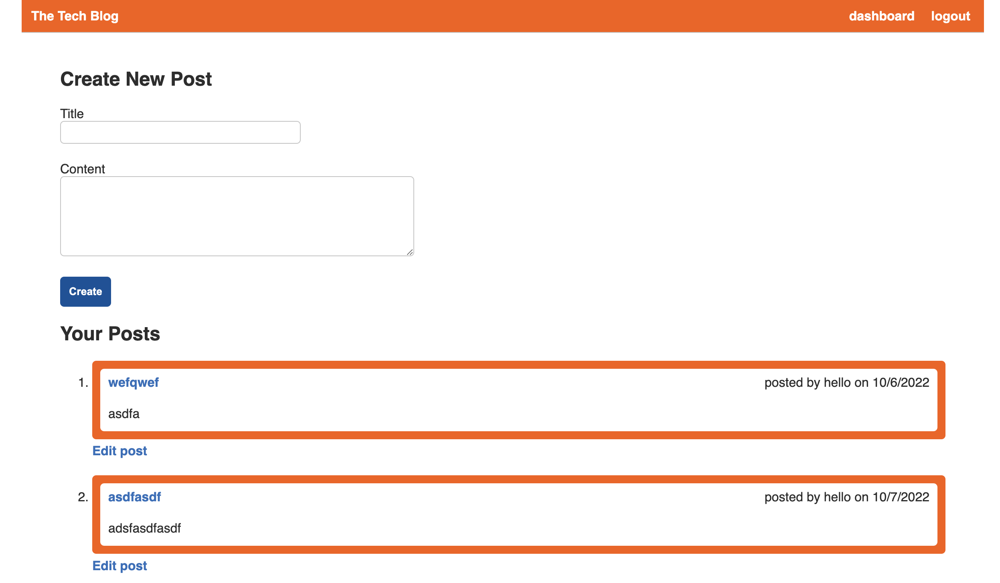
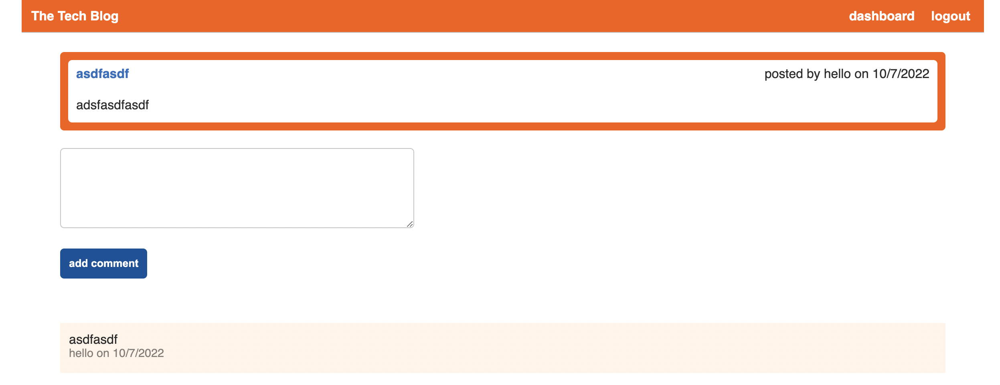
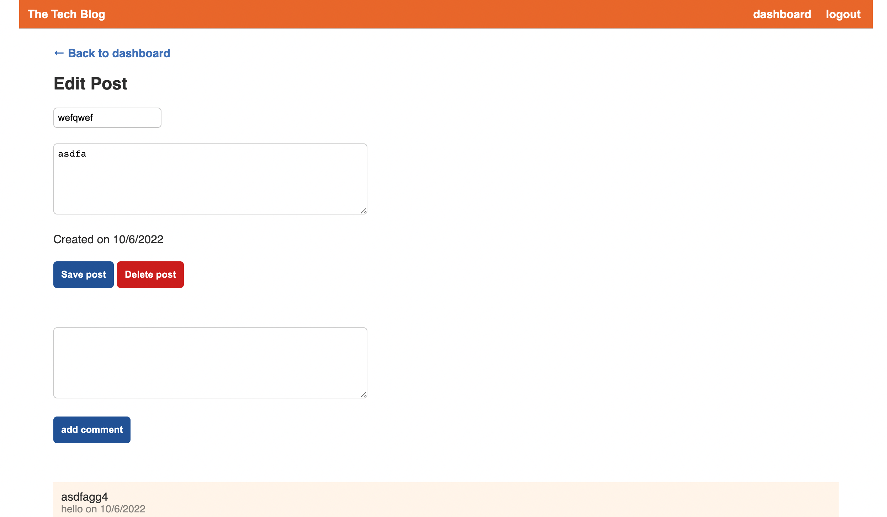

# Tech Blog
 
## Description
This application operates as an CMS-style blog site where developers can publish their blog posts and comment on other developers'' posts.

## Table of contents

* [Installation](#installation)
* [Usage](#usage)
* [License](#license)

* [Questions](#questions)

## Installation
This application utilizes various npm packages such as express, MySQL2, sequelize, dotenv, bcrypt, express-sessions, handlebars, connection session sequalize. to install the listed packages, enter "npm i" in the root directory terminal.
        

## Usage
This application can be used by clicking on this deployed link. 

* Homepage - allows user to view list of posts posted by other users. Click into each post to view comments from other users.  

* Login page - allows user to login to their account in order to create and manage posts and comments. 

* Signup page - used to create new accounts. 

* Dashboard - allows users to managed and create new post. 

* Comment - comments can be created for each post if the user is logged in. 

* Edit/delete - User is able to edit or delete their previous posts. 

        
## License
This application has the following licenses:
* [MIT License](https://choosealicense.com/licenses/mit/)

                    

## Questions
If you have any questions feel free to contact me using the following sources:  
GitHub: [tonymengt](https://github.com/tonymengt)  
Email: [tonymengt@gmail.com](mailto:tonymengt@gmail.com)
